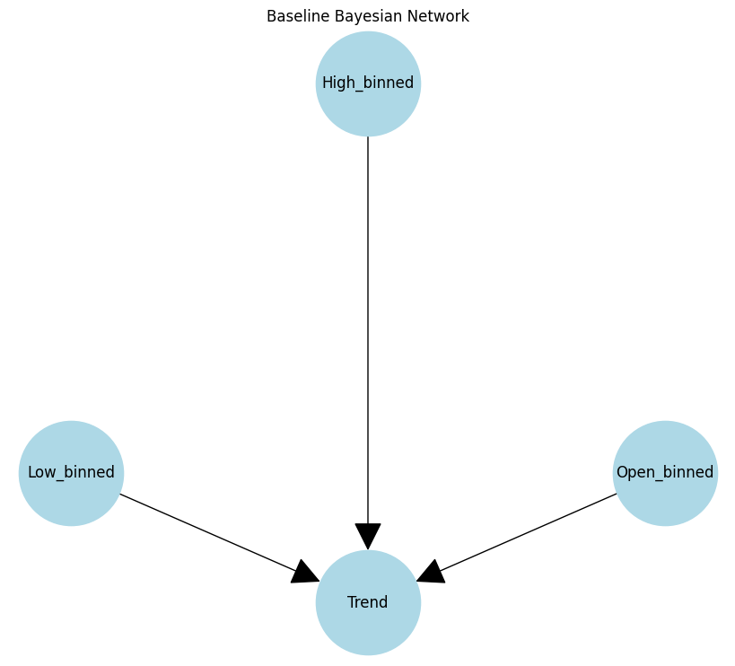
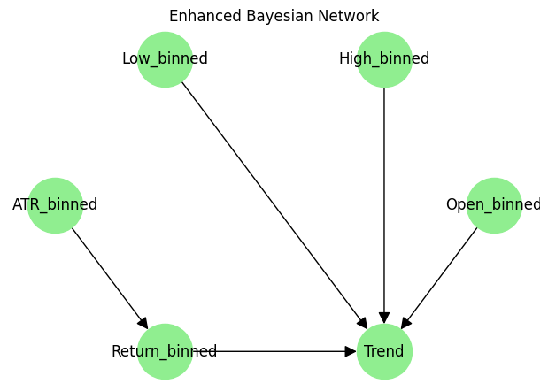

# Probabilistic Stock Trading Agent

## Overview

This project develops a **goal-based probabilistic stock trading agent** designed to predict whether the next day’s stock *Close* price (closing price of the day) will exceed today’s. Our primary objective is to maximize profit while managing risk by combining advanced probabilistic models, feature engineering, and reinforcement learning techniques.

Over the evolution of this project, we have achieved several key milestones:

- **Enhanced Data Preprocessing & Feature Engineering:**  
  We incorporated technical indicators, lagged features, and discretization techniques (using quantile-based binning with winsorization) to robustly represent market dynamics.

- **Optimized Bayesian Network Modeling:**  
  We moved from a simple, fixed-structure baseline Bayesian network to an **Enhanced Bayesian Network** that leverages hyperparameter tuning and structure learning (via HillClimbSearch) to capture more nuanced relationships among market variables.

- **Hidden Markov Model (HMM) Integration:**  
  By fitting a Gaussian HMM on technical indicators, we infer latent market regimes (e.g., bull, bear, and stagnant markets) that enrich our feature space and improve model performance.

- **Reinforcement Learning (RL) for Trading Strategy:**  
  We implemented a Q-learning agent in a simulated trading environment to prototype an RL-based trading strategy that uses discretized market features and inferred HMM regimes.

---

## Project Achievements & Optimization Details

### 1. PEAS/Agent Analysis

**Performance Measure:**  
- **Maximize Profit:** Accurately predict whether the next day’s *Close* price will exceed today’s to maximize trading gains.  
- **Risk Management:** Incorporate market regime analysis and reinforcement learning to adapt to changing market conditions.

**Environment:**  
- **Stock Market Data:** Historical data with raw price information and technical indicators.  
- **Simulated Trading Environment:** A simplified simulation (`SimpleTradingEnv`) that uses our discretized features and HMM-derived market regimes.

**Actuators:**  
- **Trading Actions:** The agent chooses among `buy`, `sell`, or `hold`.

**Sensors:**  
- **Market Features:** Inputs include discretized variables (e.g., `Open_binned`, `High_binned`, `Low_binned`), engineered features (e.g., `ATR_binned`, `Return_binned`), and the inferred `Market_Regime`.  
- **Technical Indicators:** Computed values such as ATR, Bollinger Bands, RSI, and MACD capture market dynamics.

### 2. Baseline Data Exploration & Preprocessing

#### Data Source
- **Dataset:** [Stock Time Series 20050101 to 20171231](https://www.kaggle.com/datasets/szrlee/stock-time-series-20050101-to-20171231)
- **Description:** Over a decade of daily stock market data for various stocks (fields include Date, Open, High, Low, Close, Volume, Name).
- **Observations:** Approximately 93,612 observations.

#### Exploratory Data Analysis (EDA)
In our [EDA_Preprocessing.ipynb](https://github.com/ryanrowe2/StockTradingAI-Project/blob/Milestone2/notebooks/EDA_Preprocessing.ipynb) notebook, we computed:
- **Summary Statistics:**
  - The "Close" price showed a mean of 85.64, median of 60.05, and standard deviation of 108.12.
- **Visualizations:**  
  - Histograms for the "Close" price revealed a right-skewed distribution:
    
    

  - Box plots helped identify outliers:
 
    
    
- **Missing Data:**  
  - We identified and imputed missing numerical values using column means.

#### Preprocessing Steps
- **Normalization & Transformation:**  
  - **Normalization:** We applied StandardScaler to standardize features (mean=0, std=1).  
  - **Log Transformation:** A log transformation was used to reduce skewness in price and volume data.
- **Discretization:** Continuous features such as **Open** (opening price of the day), **High** (daily highest price), and **Low** (daily lowest price) were discretized into quantile-based bins (5 bins by default).  
- If `X` is a continuous variable (e.g., the Open price), then its binned version `X_binned` is defined by partitioning the range of `X` into 5 intervals (quantiles). If the data is uniformly distributed, each bin will contain roughly 20% of the data, leading to conditional probabilities of about 0.2 for each bin.
  - **Result:** New features `Open_binned`, `High_binned`, and `Low_binned` represent categorical approximations of the original values.
- **CPT Generation:**  
  Frequency counts for each bin were normalized to create Conditional Probability Tables (CPTs). These CPTs capture the probability distribution of the discretized features and are used for probabilistic inference in our Bayesian network.

### 3. Enhanced Data Processing & Feature Engineering

Before model training, the raw stock data undergoes a series of sophisticated preprocessing steps:

- **Winsorization**  
  We limit extreme values in critical features (e.g., *Close*, *High*, *Low*) to reduce the influence of outliers:
  
  ```python
  df = apply_winsorization(df, ['Close', 'High', 'Low'])
  ```
  
  Winsorization caps extreme values, ensuring that the subsequent discretization is not skewed by outliers, leading to more stable conditional probability estimates in our Bayesian networks.

- **Technical Indicators and Lagged Features**  
  Using `add_technical_indicators(df)`, we compute:
  
  - **ATR (Average True Range):** Measures market volatility.
  - **Bollinger Bands:** Captures standard deviation bounds around a moving average.
  - **Lagged Features:** Incorporates prior-day values (e.g., `Close_Lag1`, `Return_Lag1`) to capture temporal dependencies.
  
  ```python
  df = add_technical_indicators(df)
  ```
  
  These features provide a richer representation of market conditions, which, when discretized, yield more informative states for the network.

- **Discretization**  
  Continuous features are converted into categorical bins:
  
  ```python
  continuous_features = ['Close', 'ATR', 'BB_Middle', 'BB_Upper', 'BB_Lower', 'Return', 'Close_Lag1', 'Return_Lag1']
  df = discretize_features(df, continuous_features, num_bins=config['num_bins'], method=config['discretization_method'])
  ```
  
  Bayesian networks perform better with discrete states; using quantile-based binning preserves the distribution and ensures balanced bin frequencies.

- **Feature Selection with Preservation**  
  We remove highly correlated features while preserving essential ones:
  
  ```python
  preserve_cols = ['Open_binned', 'High_binned', 'Low_binned', 'ATR_binned', 'Return_binned', 'Close_binned', 
                   'BB_Middle_binned', 'BB_Upper_binned', 'BB_Lower_binned', 'Close_Lag1_binned', 'Return_Lag1_binned', 'Trend']
  df = feature_selection(df, target='Trend', threshold=0.95, preserve=preserve_cols)
  ```
    
  Removing redundancy avoids overfitting and ensures that the network’s conditional probability tables (CPTs) are estimated from non-redundant, high-quality data.

---

### 4. Hidden Markov Model (HMM) for Market Regime Detection

The HMM integration further enriches our dataset by identifying latent market regimes:

```python
from hmmlearn.hmm import GaussianHMM
model = GaussianHMM(n_components=3, covariance_type="diag", n_iter=100, random_state=42)
latent_states = model.fit_predict(df[indicators].values)
df['Market_Regime'] = latent_states
```

**Explanation:**

- **Technical Indicators for HMM:**  
  Indicators such as `MA_20`, `RSI_14`, and `MACD` are used as features to fit the HMM.
  
- **Latent Market Regimes:**  
  The HMM clusters the data into 3 latent states, representing different market conditions (e.g., bull, bear, and stagnant).
  
- **Impact on the Model:**  
  These regimes are later added as a feature, further improving the predictive power of our Bayesian network.

*Code Snippet from `hmm_integration.py`:*

```python
def fit_hmm_on_indicators(df, indicators=['MA_20', 'RSI_14', 'MACD'], n_components=3):
    df_ind = df[indicators].dropna()
    X = df_ind.values
    model = hmm.GaussianHMM(n_components=n_components, covariance_type="diag", n_iter=100, random_state=42)
    latent_states = model.fit_predict(X)
    states_series = pd.Series(latent_states, index=df_ind.index, name='Market_Regime')
    df = df.join(states_series)
    df['Market_Regime'].fillna(method='ffill', inplace=True)
    return model, df
```

Incorporating the HMM state into the feature set allows the Enhanced Bayesian Network to condition its predictions on latent market conditions, leading to better differentiation between market phases and improved accuracy.

---

#### 5. Bayesian Network Structures

- **Baseline BN Structure:**
  - **Structure:**

<br>




<br>

  - **Assumption:**  
    Each predictor independently influences the trend without any mutual interaction.
  - **Modeling Implication:**  
    This simplified architecture may fail to capture complex interdependencies, limiting its ability to reflect true market dynamics.

- **Enhanced BN Structure:**
  - **Structure:**  
    The enhanced network starts with an extended feature set:
    ```
    [Open_binned, High_binned, Low_binned, ATR_binned, Return_binned]
    ```

    - **Open_binned:** Discretized version of the stock’s opening price, partitioned into quantile-based bins to capture relative price levels.

    - **High_binned:** Discretized version of the stock’s highest price during the day, representing price extremes in a categorical format.

    - **Low_binned:** Discretized version of the stock’s lowest price during the day, used to indicate minimum price levels in a simplified form.

    - **ATR_binned:** Discretized version of the Average True Range (ATR), a technical indicator that measures market volatility, grouped into categorical levels.

    - **Return_binned:** Discretized version of the daily return (percentage change in closing price), categorizing market performance into distinct bins.

    - **Trend**: The target variable indicating whether the next day’s closing price is higher than today’s, effectively representing the direction of the market (upward trend vs. no upward movement).
  
    Structure learning via HillClimbSearch enables the model to add edges not only from each predictor to `Trend` but also between predictors. For example, a potential learned structure might look like:

    <br>

    

    <br>

  - **Assumption:**  
    The structure is data-driven; it reflects both the direct influences of predictors on `Trend` and the interdependencies among predictors (e.g., volatility influencing returns).
  - This more complex structure allows the Enhanced BN to capture underlying causal relationships and conditional dependencies that are crucial for predicting market trends more accurately.
    
*Example Code Snippet Illustrating Structure Learning:*

```python
# Using HillClimbSearch to learn the structure for the enhanced model:
for i in range(bn_trainer.num_restarts):
    structure_model = bn_trainer.learn_structure(df, enhanced_features + ['Trend'], seed=i)
    # Evaluate this learned structure on a validation split...
    if acc > best_structure_score:
        best_structure_score = acc
        best_structure = structure_model
logging.warning(f"Best structure validation accuracy: {best_structure_score:.4f}")
```

The enhanced network's flexibility to learn and represent complex relationships directly translates to better model performance, as it effectively captures the inherent uncertainty and interactions within stock market data.

---

### 6. Baseline vs. Enhanced Bayesian Network

Our project’s capstone is the optimization of the Bayesian network model. We build two models for comparison:

- **Baseline Bayesian Network:**  
  Uses a minimal feature set:
  
  ```python
  baseline_candidates = ['Open_binned', 'High_binned', 'Low_binned']
  baseline_features = [col for col in baseline_candidates if col in df.columns]
  ```
  
  The baseline network assumes a simple structure:
  
  ```python
  edges = [(feature, 'Trend') for feature in baseline_features]
  model = BayesianNetwork(edges)
  model.fit(df[baseline_features + ['Trend']], estimator=BayesianEstimator, prior_type='BDeu', equivalent_sample_size=15)
  ```
  
This fixed structure may miss important market signals present in additional features.

- **Enhanced Bayesian Network:**  
  Our enhanced model extends the feature set:
  
  ```python
  enhanced_candidates = baseline_candidates + ['ATR_binned', 'Return_binned']
  enhanced_features = [col for col in enhanced_candidates if col in df.columns]
  ```
  
  **Optimization Logic:**
  
  1. **Hyperparameter Tuning (Grid Search):**  
     We run a grid search over Bayesian estimator parameters such as `equivalent_sample_size` and `prior_type`:
     
     ```python
     best_params = bn_trainer.grid_search_estimator(df, enhanced_features, 'Trend', cv_splits=config['cv_splits'])
     ```
     
     - **Equivalent Sample Size (ESS):** Balances the strength of the prior against the data evidence.
     - **Prior Type (BDeu):** Sets a uniform prior that smooths the CPTs.
     
     This tuning ensures that our probability estimates are neither too rigid (overly influenced by the prior) nor too noisy.
  
  2. **Structure Learning via HillClimbSearch:**  
     Instead of a fixed structure, we let the algorithm search for an optimal dependency structure:
     
     ```python
     structure_model = bn_trainer.learn_structure(df, enhanced_features + ['Trend'], seed=i)
     ```
     
     We restart the search several times to avoid local optima:
     
     ```python
     for i in range(bn_trainer.num_restarts):
         structure_model = bn_trainer.learn_structure(df, enhanced_features + ['Trend'], seed=i)
         # Evaluate on a validation split...
     ```
     
     A learned structure can capture conditional dependencies between features (e.g., how volatility influences returns), leading to a more accurate and robust model.
  
  3. **Final Evaluation:**  
     The enhanced BN, with tuned parameters and learned structure, shows improved performance on the holdout set:
     
     ```python
     _, _, bn_accuracy, _ = bn_trainer.evaluate_model(enhanced_bn_model, test_df, enhanced_features, 'Trend')
     print(f"Final Holdout Accuracy -> Enhanced BN: {bn_accuracy:.4f}")
     ```
      
     The Enhanced BN outperforms the baseline by capturing additional market dynamics, as evidenced by a higher holdout accuracy.

---

### 7. Reinforcement Learning (RL) Integration

We have also prototyped a Q-learning agent to explore RL-based trading strategies. Our RL component demonstrates another frontier of decision-making in our system.

*Key Snippet from `rl_agent.py`:*

```python
class QLearningAgent:
    def __init__(self, actions=['buy', 'sell', 'hold'], alpha=0.1, gamma=0.95, epsilon=0.1):
        self.q_table = {}
        self.actions = actions
        self.alpha = alpha      # Learning rate
        self.gamma = gamma      # Discount factor
        self.epsilon = epsilon  # Exploration rate

    def choose_action(self, state_features):
        state = tuple(state_features)
        if random.random() < self.epsilon or state not in self.q_table:
            return random.choice(self.actions)
        else:
            return max(self.q_table[state], key=self.q_table[state].get)

    def update_q_value(self, state_features, action, reward, next_state_features):
        state = tuple(state_features)
        next_state = tuple(next_state_features)
        if state not in self.q_table:
            self.q_table[state] = {a: 0.0 for a in self.actions}
        if next_state not in self.q_table:
            self.q_table[next_state] = {a: 0.0 for a in self.actions}
        max_future_q = max(self.q_table[next_state].values())
        current_q = self.q_table[state][action]
        new_q = current_q + self.alpha * (reward + self.gamma * max_future_q - current_q)
        self.q_table[state][action] = new_q
```

*Explanation:*

- **Epsilon-Greedy Policy:** Balances exploration and exploitation.
- **Q-table Update:** Uses the Bellman equation to iteratively refine Q-values based on received rewards.
- **Integration with Trading Environment:**  
  The `SimpleTradingEnv` class simulates the market, and the agent’s performance is evaluated by its cumulative reward over episodes.

The performance of the RL prototype using the inferred HMM regimes is explored in [HMM_and_RL_Experiments.ipynb](https://github.com/ryanrowe2/StockTradingAI-Project/blob/Milestone3/notebooks/HMM_and_RL_Experiments.ipynb)

---

## 8. Results & Comparative Analysis

### Performance Metrics

- **Baseline BN Accuracy:**  
  The baseline Bayesian network, which only uses basic discretized features (e.g., `Open_binned`, `High_binned`, `Low_binned`), achieved a cross-validation accuracy of approximately **55.7%**.
  
- **Enhanced BN Accuracy:**  
  By incorporating additional features (like `ATR_binned` and `Return_binned`), tuning hyperparameters via grid search, and optimizing the network structure with HillClimbSearch, our Enhanced Bayesian Network achieved a holdout accuracy of approximately **64.4%**.

### Why the Enhanced BN Outperforms the Baseline

1. **Richer Feature Set:**  
   Including indicators of volatility and returns provides the network with deeper insights into market dynamics.
   
2. **Hyperparameter Optimization:**  
   The grid search over the Bayesian estimator’s parameters ensures that our CPTs are accurately estimated, striking the right balance between data and prior belief.
   
3. **Structure Learning:**  
   The use of HillClimbSearch with multiple restarts allows the model to discover a dependency structure that more accurately reflects the underlying relationships between features and the target.

4. **Incorporation of Latent Market Regimes (via HMM):**  
   The additional market regime feature further refines the model’s understanding of market states, enabling more context-aware predictions.

## Training Code Snippet

*Illustrative Training Code Snippet from `model_training.py`:*

```python
# Enhanced feature set
enhanced_candidates = baseline_candidates + ['ATR_binned', 'Return_binned']
enhanced_features = [col for col in enhanced_candidates if col in df.columns]

# Grid Search for optimal estimator parameters
best_params = bn_trainer.grid_search_estimator(df, enhanced_features, 'Trend', cv_splits=config['cv_splits'])

# Structure Learning with multiple restarts
best_structure_score = -np.inf
best_structure = None
for i in range(bn_trainer.num_restarts):
    structure_model = bn_trainer.learn_structure(df, enhanced_features + ['Trend'], seed=i)
    # Evaluate on a validation split...
    if acc > best_structure_score:
        best_structure_score = acc
        best_structure = structure_model
logging.warning(f"Best structure validation accuracy: {best_structure_score:.4f}")

# Final model training on full data using the best structure and parameters
enhanced_bn_model = BayesianNetwork(list(best_structure.edges()))
enhanced_bn_model.fit(df[enhanced_features + ['Trend']],
                      estimator=BayesianEstimator,
                      prior_type=best_params.get('prior_type', 'BDeu'),
                      equivalent_sample_size=best_params.get('equivalent_sample_size', 15))
```

Each enhancement—whether through additional features, careful parameter tuning, or dynamic structure learning—works to refine the conditional probability distributions the network uses to predict trends. The improved accuracy is a direct result of better representing the uncertainty and complex relationships inherent in stock market data.

---

## Repository Structure

```
Probabilistic-Stock-Trading-Agent/
├── data/
│   ├── raw/                             # Original stock market datasets
│   └── processed/                       # Processed data with enriched features, HMM regimes, and CPTs
├── docs/
│   └── README_experiments.md            # Detailed experiment reproducibility guide
├── images/                              # Images included in the README.md file.
│   ├── image.png
│   └── image-1.png
├── notebooks/
│   ├── EDA_Preprocessing.ipynb          # Exploratory data analysis from Milestone 2
│   ├── Model_Training_Evaluation.ipynb  # Bayesian Network training and evaluation from Milestone 2
│   └── HMM_and_RL_Experiments.ipynb     # HMM integration and RL experiments with learning curves and regime plots
├── scripts/
│   ├── data_processing.py               # Data cleaning, transformation, feature engineering, HMM integration, and CPT generation
│   ├── model_training.py                # Bayesian network training and evaluation (Enhanced BN optimization)
│   ├── technical_indicators.py          # Computation of technical indicators (MA, RSI, MACD)
│   ├── hmm_integration.py               # Fitting Gaussian HMM on technical indicators for market regime detection
│   └── rl_agent.py                      # Q-learning RL agent and simple trading environment prototype
├── requirements.txt                     # Dependencies (e.g., pgmpy, hmmlearn, scikit-learn)
└── README.md                            # This comprehensive project document
```

---

## Conclusion

Our project demonstrates that by combining advanced feature engineering, probabilistic modeling, and optimization techniques, we can significantly improve the predictive performance of a stock trading agent. The Enhanced Bayesian Network—optimized through hyperparameter tuning and structure learning—outperforms its baseline counterpart by better capturing the complexities of market behavior. The integration of HMM-derived market regimes and preliminary reinforcement learning prototypes further expands the horizons of our trading strategy.

---

## How to Run the Project

1. **Data Processing:**  
   ```bash
   python scripts/data_processing.py
   ```
2. **Bayesian Network Training & Evaluation:**  
   ```bash
   python scripts/model_training.py
   ```
3. **RL Agent Simulation & HMM Experiments:**  
   Open the Jupyter notebooks in the `notebooks/` directory:
   - `EDA_Preprocessing.ipynb`
   - `Model_Training_Evaluation.ipynb`
   - `HMM_and_RL_Experiments.ipynb` (see [docs/README_experiments.md](https://github.com/ryanrowe2/StockTradingAI-Project/blob/Milestone3/docs/README_experiments.md) for more detail)

## Parameter Calculation for Conditional Probability Tables (CPTs)

Our Bayesian network requires estimation of the conditional probability distributions (CPTs) for each node given its parent nodes. We compute these parameters using two common approaches:

1. **Maximum Likelihood Estimation (MLE):**

   For a given node X with a set of parent variables Pa(X), the probability P(X=x | Pa(X)=p) is estimated by:
   
   P(X=x | Pa(X)=p) = N(x, p) / N(p)
   
   - N(x, p) is the count of occurrences where X=x and Pa(X)=p in the dataset.
   - N(p) is the total count of occurrences for the parent configuration p.

2. **Bayesian Estimation:**

   To smooth the estimates and handle cases where counts may be low (or even zero), we use a Dirichlet prior. Specifically, we employ the Bayesian estimator (using a BDeu prior) implemented in pgmpy. The conditional probability is then given by:
   
   P(X=x | Pa(X)=p) = (N(x, p) + α) / (N(p) + α ⋅ |*X*|)
   
   - α is the equivalent sample size (a hyperparameter that controls the strength of the prior).
   - |*X*| is the number of discrete states that X can take.
   - This formula ensures that even when N(x, p) = 0, the probability is nonzero, thus preventing issues in subsequent probabilistic inference.

*Note:* In our implementation, the grid search over the Bayesian estimator parameters (i.e., α and the choice of prior type) helps in finding an optimal balance between the observed data and our prior assumptions.

Below is a brief code snippet illustrating how we integrate these estimations within our model training process:

```python
# Example: Using Bayesian Estimation to compute CPTs
# For a node X with parent configuration p, the conditional probability is:
# P(X=x | Pa(X)=p) = (N(x, p) + α) / (N(p) + α * |X|)
# This is implemented via pgmpy's BayesianEstimator as follows:

enhanced_bn_model.fit(
    df[enhanced_features + ['Trend']],
    estimator=BayesianEstimator,
    prior_type=best_params.get('prior_type', 'BDeu'),
    equivalent_sample_size=best_params.get('equivalent_sample_size', 15)
)
```

This approach allows us to robustly estimate the conditional probability tables, accounting for both the data and our prior knowledge, and ultimately supports better inference in our probabilistic stock trading agent.

## Technical Details and Library Explanations

### Library Explanations

- **pgmpy:**  
  pgmpy is a Python library for Probabilistic Graphical Models. It provides tools for creating, learning, and performing inference on Bayesian networks and other graphical models. In our project, we use it to build and optimize our Bayesian networks, including structure learning and parameter estimation.  
  *Source: [pgmpy Documentation](https://pgmpy.org)*

- **hmmlearn:**  
  hmmlearn is a Python library designed for Hidden Markov Models. Our core model uses a Gaussian HMM, which assumes that the observed data are generated from a mixture of Gaussian distributions rather than discrete states. This allows us to model continuous market indicators directly. Inference in a Gaussian HMM is performed using algorithms such as the Forward-Backward algorithm for state estimation and the Viterbi algorithm to find the most likely sequence of hidden states.  
  *Source: [hmmlearn Documentation](https://hmmlearn.readthedocs.io)*

- **scikit-learn & matplotlib:**  
  These libraries are used for data preprocessing, statistical analysis, and visualization throughout the project.

### Core Model: Gaussian HMM

Our project uses a Gaussian Hidden Markov Model (Gaussian HMM) as a core component for inferring latent market regimes. This model differs from discrete Bayesian networks in several ways:

- **Continuous Observations:**  
  Instead of categorizing data into discrete bins, the Gaussian HMM models continuous data by assuming each hidden state emits observations following a Gaussian distribution.

- **State Transitions:**  
  The model defines a set of hidden states with transition probabilities between them. The inference process involves:
  - **Forward-Backward Algorithm:** Computes the probability P(z<sub>t</sub> | X) for each state at time t.
  - **Viterbi Algorithm:** Determines the most likely sequence of hidden states given the observed data.
  
This continuous approach allows us to capture the subtleties of market behavior that may be lost in discretization.

Source: [hmmlearn's GaussianHMM Documentation](https://hmmlearn.readthedocs.io/en/latest/api.html#gaussianhmm)

### Non-Core Component: HillClimbSearch for Structure Learning

For learning the structure of our Enhanced Bayesian Network, we use HillClimbSearch—a search algorithm that iteratively adds, removes, or reverses edges in the network to optimize a scoring metric (such as the BDeu score). This algorithm is implemented in pgmpy and helps identify a network structure that better captures the conditional dependencies among variables.

Source: [pgmpy's HillClimbSearch Documentation](https://pgmpy.org/structure_estimator/hill.html)

---

## References

- [pgmpy Documentation](https://pgmpy.org)
- [scikit-learn Documentation](https://scikit-learn.org)
- [hmmlearn Documentation](https://hmmlearn.readthedocs.io)
- [Matplotlib Documentation](https://matplotlib.org)
