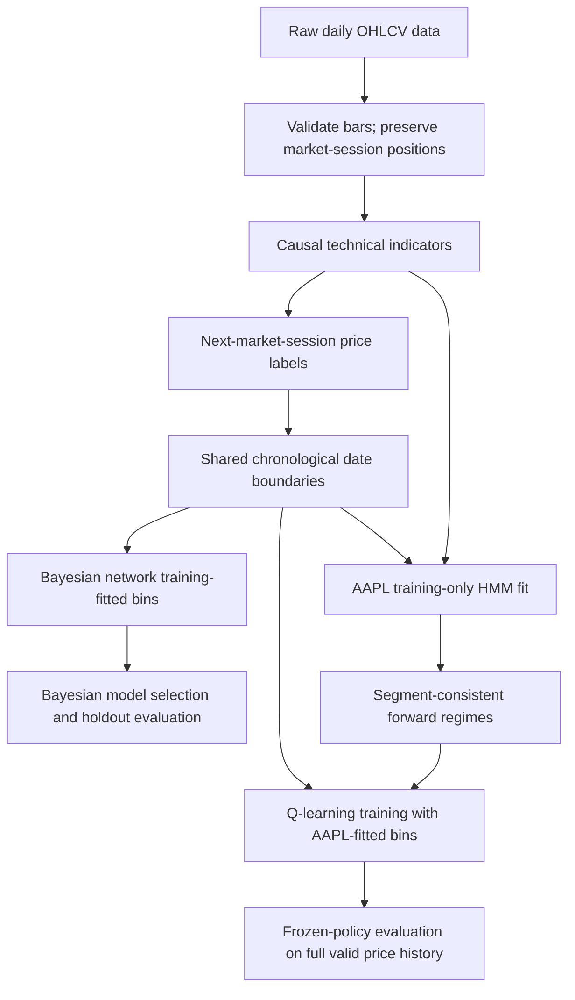

# Probabilistic Stock Trading Agent

**Bayesian networks · Time-series feature engineering · Hidden Markov models · Q-learning**

A Python research project exploring probabilistic next-session stock-direction prediction and sequential trading decisions. The system turns daily equity observations into technical indicators, estimates conditional probabilities with Bayesian networks, analyzes latent market regimes with a Gaussian Hidden Markov model, and experiments with an interpretable Q-learning agent.

The project emphasizes **reproducible experiments, chronological evaluation, and modular model implementations**.

## Project at a glance

| Component | Implementation |
| --- | --- |
| Historical data | 93,612 source observations across 31 stocks, 2006–2017 |
| Feature engineering | ATR, RSI, MACD, moving averages, Bollinger Bands, and price-normalized returns and ranges |
| Probabilistic prediction | Baseline and enhanced discrete Bayesian networks with BDeu smoothing |
| Regime analysis | Gaussian HMM with forward-filtered state inference |
| Trading experiment | Long-or-flat Q-learning agent with next-open execution and transaction costs |
| Evaluation | Chronological training/validation/test periods and classification metrics |

### System architecture


```mermaid
flowchart TD
    A["Raw daily OHLCV data"] --> B["Validate bars; preserve market-session positions"]
    B --> C["Causal technical indicators"]
    C --> D["Next-market-session price labels"]
    D --> E["Shared chronological date boundaries"]
    E --> F["Bayesian network training-fitted bins"]
    F --> G["Bayesian model selection and holdout evaluation"]
    C --> H["AAPL training-only HMM fit"]
    E --> H
    H --> I["Segment-consistent forward regimes"]
    I --> J["Q-learning training with AAPL-fitted bins"]
    E --> J
    J --> K["Frozen-policy evaluation on full valid price history"]
```

Each ticker's indicators and next-session labels are computed independently. Ticker
identifiers are normalized consistently, including for direct indicator calls;
literal symbols such as `NA` are preserved during CSV loading. Date boundaries
are shared across the Bayesian and AAPL trading experiments, so their partitions
correspond to the same historical market periods. Source-observed market-session
positions use the entire source's valid market dates, even when selecting one
ticker before validating its prices. Close-to-close daily returns, RSI changes,
and prediction targets do not bridge missing sessions. HMM fitting and forward
filtering restart at incomplete observations or missing source sessions, so
both use the same contiguous-sequence model. Target dates must follow their
feature dates by exactly one recorded market session.
An experiment rejects a ticker with no usable validated history or without
observations in each chronological partition, and reports ticker coverage for
training, validation, and test separately.

## Core implementations

### 1. Bayesian-network prediction

The supervised target is whether the **next market session's closing price** is higher than the current session's close. Observations without a valid next-session close are excluded:

$$
\mathrm{Trend}_t = \mathbf{1}\left[\mathrm{Close}_{t+1} > \mathrm{Close}_t\right].
$$

Two discrete Bayesian networks support a controlled feature-set comparison:

| Model | Features |
| --- | --- |
| Baseline | Consecutive-session close-to-close return, intraday return, daily high-low range (normalized by opening price) |
| Enhanced | Baseline features plus MACD normalized by closing price |

Both use an explicit feature-to-target directed graph. Price-relative features allow observations from differently priced stocks to share meaningful bins. The training workflow estimates conditional probability tables with a **Bayesian Dirichlet equivalent uniform (BDeu) prior** and selects equivalent sample size using validation data.

Both feature sets use the same chronological partitions. For validation-based model selection, quantile bins are fitted on training data only. After selecting the prior strength, the bins and model are refitted on the combined training and validation observations before the final test evaluation. The report includes accuracy, balanced accuracy, precision, recall, F1, ROC AUC, and a majority-class benchmark.

**Implementation:** [`scripts/model_training.py`](scripts/model_training.py)

### 2. Hidden Markov market regimes

The Gaussian HMM models technical-indicator observations as emissions from latent market states. Its inference routine performs **forward filtering**, estimating the regime at each date from information available through that date. During fitting, complete-indicator training observations are divided into contiguous source-market-session segments so the model does not learn fictitious one-session transitions across missing bars. Filtering restarts from the learned initial-state distribution after the same gaps, matching the fitted independent-sequence treatment. The fitting helper records the ordered indicator names and rejects incompatible inference feature orders. Single-ticker inputs normalize ticker spelling and case consistently with the data pipeline.

The [HMM and RL notebook](notebooks/HMM_and_RL_Experiments.ipynb) illustrates regime assignments for a single ticker, including a separate later period.

**Implementation:** [`scripts/hmm_integration.py`](scripts/hmm_integration.py)

### 3. Q-learning trading simulator

The tabular Q-learning agent considers **buy, sell, and hold**, allowing buys only when flat and sells only when invested. States combine training-binned daily return and RSI, a forward-filtered market regime, and the current position. State components must be actual integers, and transition dimensions, position changes, and Q-value updates are checked for validity. Decisions use completed daily observations; orders execute at the **next session's open**. A single-symbol simulation requires consecutive recorded market sessions; training splits at missing feature sessions rather than treating weeks as one trading step. The simulator tracks overnight gaps, intraday price changes, and transaction costs, rejecting nonfinite step and cumulative rewards.

The experiment trains across separate contiguous episodes in an earlier historical period and evaluates the frozen policy on later observations, alongside a one-share, next-open buy-and-hold comparison.
Both outcomes are marked to the final validated source close, including the
terminal trading session that has no next-day prediction label. A share still held at
that point remains open, so the displayed P/L excludes a hypothetical final
sale and its transaction fee.

**Implementation:** [`scripts/rl_agent.py`](scripts/rl_agent.py)

## Historical evaluation results

On the included 31-ticker dataset, both Bayesian networks were evaluated on the
same later test period, after validation-based parameter selection:

| Predictor | Test accuracy | Test ROC AUC |
| --- | ---: | ---: |
| Training-majority benchmark | **52.19%** | — |
| Baseline Bayesian network | 51.79% | 0.515 |
| Enhanced Bayesian network | 51.02% | 0.508 |

Neither Bayesian network beat the majority-class benchmark on this holdout.
In the separate AAPL trading notebook, the frozen Q-learning policy earned
**-$2.45** in one-share, dollar-denominated holdout P/L, compared with
**+$52.68** for the next-open buy-and-hold comparator. These historical
experiments demonstrate the implementation and its limitations; they do not
establish predictive superiority or deployable trading profitability.

## Reproduce the experiments

**Requirements:** Python 3.10–3.12 and Git.

```bash
git clone https://github.com/ryanrowe2/StockTradingAI-Project.git
cd StockTradingAI-Project
git switch Milestone3
python -m venv .venv
```

Activate the environment (`source .venv/bin/activate` on macOS/Linux or `.venv\Scripts\activate` on Windows), then:

```bash
python -m pip install -r requirements.txt

# Prepare technical indicators and ticker-safe next-session labels.
python scripts/data_processing.py

# Train, select, and evaluate Bayesian networks on the historical dataset.
python scripts/model_training.py

# Optional: run a quicker single-ticker experiment.
python scripts/model_training.py --ticker AAPL --output data/generated/aapl_model_metrics.json
```

Generated feature tables and model metrics are saved under `data/generated/`. These artifacts can be regenerated directly from the included raw data.
The input validator raises a clear error if all valid price bars for any ticker
are discarded, rather than silently excluding that ticker.
When `--ticker` is specified, selection happens before price-bar validation,
so invalid records belonging only to other symbols do not block the experiment.
CSV parsing preserves legitimate ticker strings such as `NA`, which pandas
otherwise interprets as missing values, while rejecting explicit placeholders
such as `N/A`, `NaN`, and `NULL`. The same ticker-name validation applies to
direct indicator, HMM, and trading-environment calls. Of the 93,612 source
records, 93,435 pass OHLCV validation; 177 incomplete or contradictory rows
are excluded without modifying the raw files.
An additional `Session_Number` column preserves source-market-session positions
through this exclusion, using the source-wide calendar even for selected tickers.
A close-to-close return crossing an excluded session is unavailable for
single-day modeling rather than compressed into one day's return. Such a row
also receives no next-session direction label and is excluded from supervised
training and evaluation.

For an exact version snapshot of the verified **Python 3.12 / Linux** experiment
environment, install `requirements-repro-py312.txt` instead of the flexible
requirements files. It pins both direct and transitive dependencies; use
`requirements.txt` / `requirements-dev.txt` for other supported environments.

For tests, install the development requirements and run:

```bash
python -m pip install -r requirements-dev.txt
python -m pytest tests -q
```

### Interactive notebooks

| Notebook | Purpose |
| --- | --- |
| [Exploratory Data Analysis](notebooks/EDA_Preprocessing.ipynb) | Audit source-data quality, compare per-ticker return distributions and outliers, and chart AAPL closing prices |
| [Model Training & Evaluation](notebooks/Model_Training_Evaluation.ipynb) | Reproduce the chronological Bayesian-network comparison |
| [HMM & Q-learning Experiments](notebooks/HMM_and_RL_Experiments.ipynb) | Visualize filtered regimes and compare an experimental trading policy with buy-and-hold |

The notebooks include saved output tables and plots for immediate viewing on GitHub. To run them interactively, optionally install and launch JupyterLab from the repository root after activating the project environment:

```bash
python -m pip install jupyterlab
jupyter lab
```

Open the files in `notebooks/` and select the project environment as the kernel. Reproduce the published outputs with `python -m scripts.refresh_notebooks`. See the [experiment reproduction guide](docs/README_experiments.md) for technical details and exact experiment settings.
The notebook reproduction helper captures stdout, stderr, rich `display()` and
expression results, and Matplotlib figures in execution order. It restores the
caller's working directory and import path, excludes existing figures from
capture, and cleans up newly created figures if a cell fails.

## Repository structure

```text
StockTradingAI-Project/
├── data/
│   ├── raw/                       # Third-party historical CSVs and source notice
│   └── generated/                 # Regenerable outputs (ignored by Git)
├── docs/
│   └── README_experiments.md      # Reproduction and methodology guide
├── notebooks/                     # EDA, model evaluation, HMM / RL experiments
├── scripts/
│   ├── date_validation.py        # Explicit daily calendar date validation
│   ├── price_validation.py       # Shared coherent-price checks
│   ├── session_validation.py     # Consistent market-session metadata
│   ├── ticker_validation.py      # Shared ticker-name normalization and checks
│   ├── data_processing.py         # Input validation and causal features
│   ├── technical_indicators.py    # Per-symbol technical indicators
│   ├── model_training.py          # Bayesian networks and time-based evaluation
│   ├── hmm_integration.py         # Gaussian HMM and forward filtering
│   ├── rl_agent.py                # Position-aware trading environment / Q-learning
│   └── refresh_notebooks.py       # Reproducible notebook tables and charts
├── tests/                         # Automated pipeline regression tests
├── .github/workflows/             # Automated verification on pushes / PRs
├── requirements.txt
├── requirements-repro-py312.txt   # Tested, pinned Python 3.12/Linux environment
├── requirements-dev.txt
└── LICENSE                        # MIT license for original software and docs
```

## Dataset and references

- **Data:** [Stock Time Series 20050101 to 20171231](https://www.kaggle.com/datasets/szrlee/stock-time-series-20050101-to-20171231). The included combined CSV spans January 2006 through December 2017.
- **Bayesian networks:** [pgmpy](https://pgmpy.org/)
- **Hidden Markov models:** [hmmlearn](https://hmmlearn.readthedocs.io/)
- **Data processing and evaluation:** [pandas](https://pandas.pydata.org/) and [scikit-learn](https://scikit-learn.org/)

## License

Original project software and documentation are licensed under the
[MIT License](LICENSE), copyright © 2026 Ryan Rowe. The historical CSVs in
[`data/raw/`](data/raw/README.md) are third-party material and are not included
under this MIT license; consult the source dataset's terms for their use.

**Ryan Rowe** · B.S., Mathematics–Computer Science, University of California San Diego
