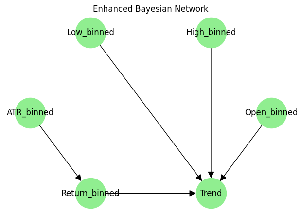

# Experiment Reproduction Guide

This document provides detailed instructions for reproducing the experiments in the **Probabilistic Stock Trading Agent** project. In these experiments, we explore advanced techniques introduced in Milestone 3, including enhanced feature engineering, optimized Bayesian network modeling, Hidden Markov Model (HMM) integration for market regime detection, and a reinforcement learning (RL) Q-learning prototype.

---

## Table of Contents

- [Overview](#overview)
- [Prerequisites](#prerequisites)
- [Repository Structure](#repository-structure)
- [Environment Setup](#environment-setup)
- [Running the Data Processing Pipeline](#running-the-data-processing-pipeline)
- [Bayesian Network Experiments](#bayesian-network-experiments)
  - [Baseline vs. Enhanced BN Structures](#baseline-vs-enhanced-bn-structures)
  - [Hyperparameter Tuning and Structure Learning](#hyperparameter-tuning-and-structure-learning)
- [HMM Integration Experiment](#hmm-integration-experiment)
- [RL Q-Learning Experiment](#rl-q-learning-experiment)
- [Evaluation and Results](#evaluation-and-results)

---

## Overview

This project develops a **goal-based probabilistic stock trading agent** designed to predict whether the next day’s stock *Close* price will exceed today’s. Our approach combines advanced probabilistic models with state-of-the-art feature engineering and reinforcement learning techniques. Key innovations include:

- Enhanced data preprocessing with technical indicators, lagged features, and robust discretization.
- An **Enhanced Bayesian Network** that is optimized via hyperparameter tuning and structure learning.
- Integration of a **Hidden Markov Model (HMM)** to infer latent market regimes that enrich the feature set.
- A Q-learning based **Reinforcement Learning (RL) agent** simulating a trading environment.

This guide explains how to reproduce all these experiments step-by-step.

---

## Prerequisites

Before running the experiments, ensure you have the following installed:

- Python 3.8 or later
- Git

The required Python packages are listed in the `requirements.txt` file at the repository root. Key dependencies include:
- `pandas`
- `numpy`
- `scikit-learn`
- `matplotlib`
- `pgmpy`
- `hmmlearn`

---

## Repository Structure

Your repository should have the following structure:

```
Probabilistic-Stock-Trading-Agent/
├── data/
│   ├── raw/                # Original stock market datasets
│   └── processed/          # Processed data with enriched features, HMM regimes, and CPTs
├── docs/
│   └── README_experiments.md    <-- (This file)
├── notebooks/
│   ├── EDA_Preprocessing.ipynb
│   ├── Model_Training_Evaluation.ipynb
│   └── HMM_and_RL_Experiments.ipynb
├── scripts/
│   ├── data_processing.py         # Data cleaning, transformation, feature engineering, HMM integration, and CPT generation
│   ├── model_training.py          # Bayesian network training and evaluation (Enhanced BN optimization)
│   ├── technical_indicators.py    # Computation of technical indicators (MA, RSI, MACD)
│   ├── hmm_integration.py         # Fitting Gaussian HMM on technical indicators for market regime detection
│   └── rl_agent.py                # Q-learning RL agent and simple trading environment prototype
├── requirements.txt               # Dependencies (e.g., pgmpy, hmmlearn, scikit-learn)
└── README.md                      # Comprehensive project document
```

---

## Environment Setup

1. **Clone the Repository:**

   ```bash
   git clone https://github.com/ryanrowe2/StockTradingAI-Project.git
   cd StockTradingAI-Project
   ```

2. **Install Dependencies:**

   Make sure you’re in the repository’s root directory and run:

   ```bash
   pip install -r requirements.txt
   ```

3. **Verify Directory Structure:**

   Confirm that the folders `docs/`, `notebooks/`, and `scripts/` are present with their respective files.

---

## Running the Data Processing Pipeline

The data processing pipeline is responsible for:

- Loading raw data from `data/raw/`
- Imputing missing values, applying log transformation, and scaling
- Computing technical indicators (MA, RSI, MACD) and adding lagged features
- Discretizing continuous features into bins and generating Conditional Probability Tables (CPTs)
- Integrating the HMM to infer latent market regimes

To run the pipeline, execute:

```bash
python scripts/data_processing.py
```

This script saves the processed CSV file (with added technical indicator and `Market_Regime` columns) and corresponding CPT JSON files in `data/processed/`.

---

## Bayesian Network Experiments

Our experiments compare two Bayesian network models: the **Baseline BN** and the **Enhanced BN**. This section explains the model structures, hyperparameter optimization, and structure learning techniques in depth.

### Baseline vs. Enhanced BN Structures

#### Baseline BN Structure
- **Feature Set:**  
  Uses basic discretized features:
  ```python
  baseline_candidates = ['Open_binned', 'High_binned', 'Low_binned']
  baseline_features = [col for col in baseline_candidates if col in df.columns]
  ```
- **Graph Structure:**  
  Every predictor has a single directed edge to the target (`Trend`):
  ```python
  edges = [(feature, 'Trend') for feature in baseline_features]
  model = BayesianNetwork(edges)
  model.fit(df[baseline_features + ['Trend']], estimator=BayesianEstimator, prior_type='BDeu', equivalent_sample_size=15)
  ```
- **Assumptions:**  
  Predictors are considered conditionally independent given the target, which simplifies the network but might miss complex interdependencies.

#### Enhanced BN Structure
- **Extended Feature Set:**  
  In addition to the baseline features, we add `ATR_binned` and `Return_binned`:
  ```python
  enhanced_candidates = baseline_candidates + ['ATR_binned', 'Return_binned']
  enhanced_features = [col for col in enhanced_candidates if col in df.columns]
  ```
- **Dynamic Structure Learning:**  
  Instead of a fixed structure, we perform **HillClimbSearch** to learn a data-driven structure:
  ```python
  structure_model = bn_trainer.learn_structure(df, enhanced_features + ['Trend'], seed=i)
  ```
  Multiple restarts help avoid local optima.
- **Possible Learned Structure Example:**

  <br>

  

  <br>

  *In this hypothetical structure, not only do predictors point to `Trend`, but additional edges (e.g., from `ATR_binned` to `Return_binned`) capture interdependencies such as the impact of volatility on returns.*

- By incorporating additional features and using structure learning, the Enhanced BN captures richer relationships among variables. This flexibility leads to more accurate conditional probability estimates and, ultimately, improved trend prediction.

*Illustrative snippet:*

```python
# Hyperparameter Tuning and Structure Learning for Enhanced BN:
best_params = bn_trainer.grid_search_estimator(df, enhanced_features, 'Trend', cv_splits=config['cv_splits'])
best_structure_score = -np.inf
best_structure = None
for i in range(bn_trainer.num_restarts):
    structure_model = bn_trainer.learn_structure(df, enhanced_features + ['Trend'], seed=i)
    # Evaluate on a validation split...
    if acc > best_structure_score:
        best_structure_score = acc
        best_structure = structure_model
logging.warning(f"Best structure validation accuracy: {best_structure_score:.4f}")
```

---

### Hyperparameter Tuning and Structure Learning

Our Enhanced BN is optimized in two key ways:

1. **Grid Search Over Estimator Parameters:**  
   We tune parameters such as `equivalent_sample_size` (ESS) and `prior_type`:
   ```python
   best_params = bn_trainer.grid_search_estimator(df, enhanced_features, 'Trend', cv_splits=config['cv_splits'])
   ```
   - **ESS:** Controls the weight given to prior belief versus observed data.
   - **Prior Type (BDeu):** Provides a uniform prior that helps stabilize probability estimates.

2. **Structure Learning with HillClimbSearch:**  
   By allowing the network to learn its structure from the data, we capture complex dependencies:
   ```python
   structure_model = bn_trainer.learn_structure(df, enhanced_features + ['Trend'], seed=i)
   ```
   Multiple restarts ensure robustness by exploring different potential structures.

The final Enhanced BN, trained on the full dataset with the best parameters and structure, achieves a significantly higher holdout accuracy compared to the baseline.

---

## HMM Integration Experiment

The HMM integration experiment demonstrates how latent market regimes, derived from technical indicators, enhance our feature set.

### Steps:
1. **Compute Technical Indicators:**  
   The `data_processing.py` script calls `add_technical_indicators(df)` to compute moving averages, RSI, and MACD.
2. **Fit the Gaussian HMM:**  
   The `hmm_integration.py` script fits a Gaussian HMM to the selected indicators:
   ```python
   from hmmlearn.hmm import GaussianHMM
   model = GaussianHMM(n_components=3, covariance_type="diag", n_iter=100, random_state=42)
   latent_states = model.fit_predict(df[indicators].values)
   df['Market_Regime'] = latent_states
   ```
3. **Output Verification:**  
   Check the processed CSV file in `data/processed/` for the `Market_Regime` column.  
   For further visualization, open the `HMM_and_RL_Experiments.ipynb` notebook where you can view plots of regime assignments and a comparison of different state configurations.

*Detailed code snippet from `hmm_integration.py`:*

```python
def fit_hmm_on_indicators(df, indicators=['MA_20', 'RSI_14', 'MACD'], n_components=3):
    df_ind = df[indicators].dropna()
    X = df_ind.values
    model = hmm.GaussianHMM(n_components=n_components, covariance_type="diag", n_iter=100, random_state=42)
    latent_states = model.fit_predict(X)
    states_series = pd.Series(latent_states, index=df_ind.index, name='Market_Regime')
    df = df.join(states_series)
    df['Market_Regime'].fillna(method='ffill', inplace=True)
    return model, df
```

By incorporating the HMM state into the feature set, our Bayesian network can better distinguish between different market conditions, leading to improved prediction accuracy.

---

## RL Q-Learning Experiment

The RL experiment evaluates a Q-learning agent in a simplified trading environment. This prototype lays the groundwork for more sophisticated reinforcement learning strategies.

### Steps:
1. **Set Up the Trading Environment:**  
   The `SimpleTradingEnv` class in `rl_agent.py` simulates the market using key discretized features.
2. **Run the Q-Learning Agent:**  
   Execute the RL script to simulate multiple episodes:
   ```bash
   python scripts/rl_agent.py
   ```
3. **Review Agent Performance:**  
   The agent prints cumulative rewards for each episode and plots a learning curve to visualize progress.

*Key code snippet from `rl_agent.py`:*

```python
class QLearningAgent:
    def __init__(self, actions=['buy', 'sell', 'hold'], alpha=0.1, gamma=0.95, epsilon=0.1):
        self.q_table = {}
        self.actions = actions
        self.alpha = alpha      # Learning rate
        self.gamma = gamma      # Discount factor
        self.epsilon = epsilon  # Exploration rate

    def choose_action(self, state_features):
        state = tuple(state_features)
        if random.random() < self.epsilon or state not in self.q_table:
            return random.choice(self.actions)
        else:
            return max(self.q_table[state], key=self.q_table[state].get)

    def update_q_value(self, state_features, action, reward, next_state_features):
        state = tuple(state_features)
        next_state = tuple(next_state_features)
        if state not in self.q_table:
            self.q_table[state] = {a: 0.0 for a in self.actions}
        if next_state not in self.q_table:
            self.q_table[next_state] = {a: 0.0 for a in self.actions}
        max_future_q = max(self.q_table[next_state].values())
        current_q = self.q_table[state][action]
        new_q = current_q + self.alpha * (reward + self.gamma * max_future_q - current_q)
        self.q_table[state][action] = new_q
```

This RL module demonstrates how our agent learns to select actions in a trading environment, paving the way for future integration with our probabilistic models.

---

## Evaluation and Results

- **Bayesian Network Evaluation:**  
  The `model_training.py` script evaluates both the Baseline and Enhanced Bayesian network models. Key metrics include accuracy, precision, recall, F1, and ROC AUC. In our experiments, the Enhanced BN shows a significant improvement (approximately 64.4% holdout accuracy) compared to the baseline (approximately 55.7% CV accuracy).

- **HMM Integration Impact:**  
  Including the latent `Market_Regime` feature improves the contextual awareness of the BN model, enabling more accurate predictions.

- **RL Agent Evaluation:**  
  The Q-learning agent’s learning curve, generated during simulation, illustrates its ability to improve cumulative rewards over multiple episodes, which is promising for future adaptive trading strategies.

For detailed comparisons, refer to the summary tables and visualizations in the `Model_Training_Evaluation.ipynb` and `HMM_and_RL_Experiments.ipynb` notebooks.
